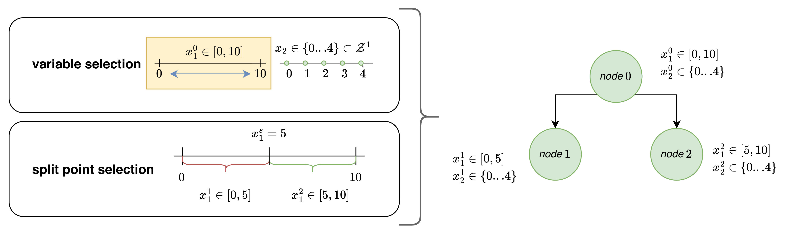
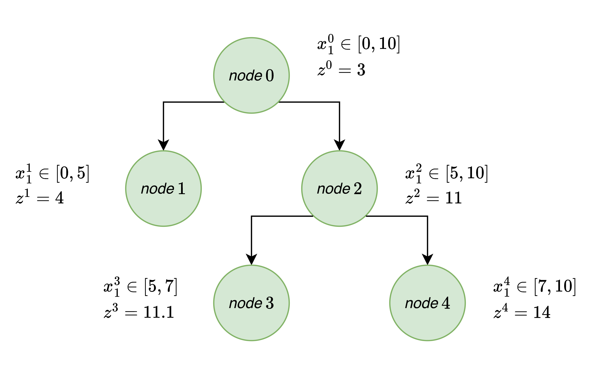
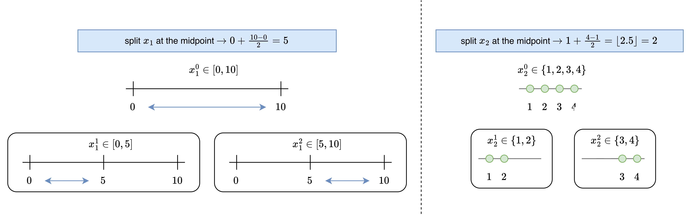
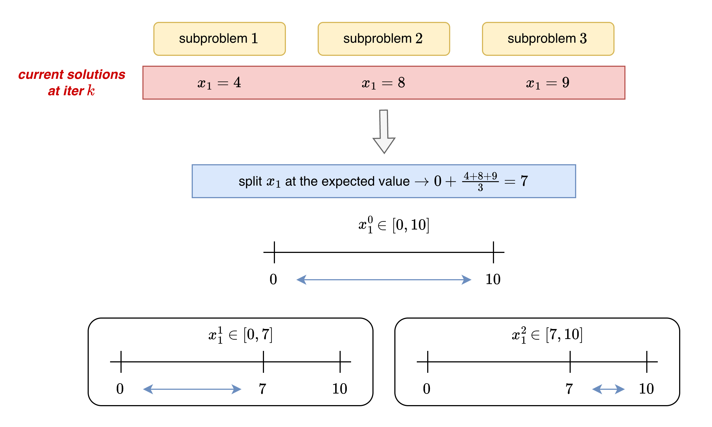

# Branching

Branching is an essential (noteably heuristic) element inherent to any branch and bound procedure. Branching is when a node, after being solved, cannot be pruned by bound (i.e., when the lower bound is higher than the current best upper bound) or by infeasibility (i.e., when the lower bound relaxation is infeasible), and is not terminal. 

To spawn a child node, we must select exactly one of the branching variables (referred to as **variable selection**). Then, we must determine where to split that variable domain (referred to as **split point selection**). 

In the case of the illustrative example, consider we have just solved the root node and need to decide between the first or the second variable and where to split. Assume we first select the continuous variable, and decide to split it at the midpoint (in this case, at 5).

<p align="center">
  
</p>

We can see, in the image above, the two distinct decisions (variable selection and split point selection) alongside with how this would be reflected within the tree structure.

---------------------------

## Variable Selection (`SelectionStrategy`)

There are inumerable ways to select a variable. There is a custom callback that users can implement to define their own strategies. SNoGloDe offers the following preset options:

**Random Selection**

Out of all of the branching variables available, select one of them at random with equal probability. 

**Most Infeasible Binary**

Selects the binary that is most violated; if there are no binaries left to branch on, randomly selects among the remaining variables. We compute the average of all of the binary variable solutions across all of the subproblems; the average closest to the midpoint (i.e. 0.5) is designated most violated and is branched on.

**Maximum Disagreement**

This is a generalization of Most Infeasible Binary that incorporates continuous/integer variables. In this case, we compute the normalized variance of each branching variable's solution within each subproblem (according to the lower bound). We select the variable that has the maximum normalized variance. 

**Pseudocost**

This is a more sophisticated branching strategy, originally developed for Mixed-Integer Linear Programs (see {cite}`achterberg2005branching` and {cite}`benichou1971experiments` for in-depth details). We can easily use it for NLP/MINLP problems, as well. 

The idea is as follows: as we traverse the tree, we will inevitably branch on the same variable more than once. We can gather information about how impactful (i.e., approximate a cost) it is to branch on a variable based on the objective value change per variable delta. 

Consider a portion of the tree where we have only branched on the continuous variable $x_1$. We have solved nodes $0,1,2,3,4$- so we can compute some pseudocost information for $x_1$ based on which *direction* we branched in (i.e., left or right) and the difference in objective values between parent and child nodes. 

<p align="center">
  
</p>

We branch left twice (node $0$ $\rightarrow$ node $1$ & node $2$ $\rightarrow$ node $3$) and right twice (node $0$ $\rightarrow$ node $2$ & node $2$ $\rightarrow$ node $4$). Clearly, just by eyeballing, we can see that branching to the right on $x_1$ provides much larger objective value gains in comparison to the branching to the left- which is exactly what the pseudocosts associated with that variable show:

&nbsp;&nbsp;&nbsp;&nbsp; pseudocost($x_1$, left) $= \frac{1}{2}(\frac{4-3}{10-5} + \frac{11.1-11}{5-2}) \approx 0.1167$

&nbsp;&nbsp;&nbsp;&nbsp; pseudocost($x_1$, right) $= \frac{1}{2}(\frac{11-3}{10-5} + \frac{14-11}{5-3}) = 1.55$

We can then use a parameterized score function to combine these two scores together into a singularly interpretable score that can be used to compare variables quickly. 

**Note:** This technique is effective, but only once enough nodes have been solved. Before that, the costs are randomly initialized and are essentially garbage. 

**Strong & Full Strong Branching**

Strong branching is another sophisticated branching strategy originally developed for Mixed-Integer Linear Programs (I highly recommend reading {cite}`achterberg2005branching` for clearer details). In the current implementation, **this can only be used for problems whose relaxation is fully linear**. If it is specified for use without satisifying the condition, SNoGloDe will get upset. Please don't upset the SNoGloDe.

Strong branching is essentially trying to "peak" into the future while branching. 

For each branching variable $x$:

1. Generate a fully linear relaxation (i.e., relax integrality constraints and/or provide linear relaxations for nonlinear functions) for each subproblem.

2. Using the Simplex method (in this case, must have access to Gurobi {cite}`gurobi`, as this is what we use), perform $\eta$ number of iterations (default is 1000) for **if we branched to the right and to the left** of $x$. 

3. Record new objective values.

Similar to Pseudocost, we will use a paramterized scoring function to combine both the right and the left score. We then select the branching variable that has the highest expected objective value change. 

The distinction between "full" strong and strong branching is that full means we perform this step for *all* branching variables; general strong branching selects a (typically randomized) subset, so as to save on computational costs.

**Note:** This is an expensive technique- but it has proven to be consistently useful. It is possible to extend this to a nonlinear case- but we have not yet gone down that road :)

**Hybrid Branching**

Hybrid branching is trying to combine the best of both worlds- typically strong branching and pseudocost. The idea is that pseudocost is effective and cheap from a computational perspective, but it can lead us astray early in the algorithm, when the costs are still essentially random numbers. Hybrid branching uses a *different* branching methodology early in the tree, collecting pseudocosts and updating in the background, and then *switches* to pseudocost once the user feels there has been enough data collected. 

SNoGloDe allows you to select your initial branching strategy, either as a custom user-specified strategy or from one of the implemented ones described here (default is Maximum Disagreement). 

---------------------------

## Split Point Selection (`PartitionStrategy`)

Once a variable has been selected, using one of the SelectionStrategy methods described above, we have to choose where to split that variables domain.

In the case of a binary variable, the decision is trivial. We select $0$ for the first child node, and $1$ for the other. When we consider integer and continuous variables, however, this becomes more involved.

**Midpoint**

This strategy only considers the current bounds on the variables and selects the midpoint. It simply splits the current domain down the center, with one small extra step in the case of integers, as shown in the following example:

<p align="center">
  
</p>


**Expected Value**

This strategy attempts to infer some information from the lower bound solution. We compute the average solution for each branching variable (across all subproblem solutions for the LB). We compute "safe" bounds (that essentially makes sure we are not branching tooooo closely to the current upper or lower bound on a variable).

<p align="center">
  
</p>


*see: snoglode/components/branching.py*

## References
```{bibliography}
:filter: docname in docnames