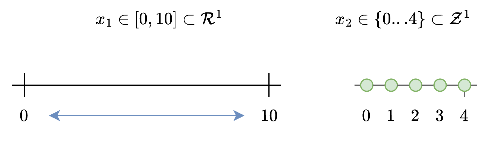

Building Blocks 
==================

This section describes the building block, core objects that support the SNoGloDe code.

For illustration purposes, consider we are in the following setting: I have two complicating variables. The first is within the real domain, and is constrained to be between 0 and 10. The second is within the integer domain, and is constrained to be between 0 and 4. 

   SNoGloDe component overview.

.. toctree::
   :maxdepth: 1
   :caption: Building Blocks

   node
   node_queue
   tree
   branching