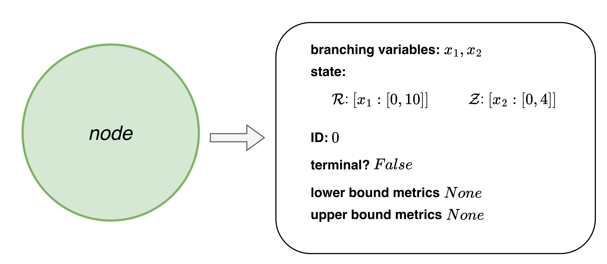
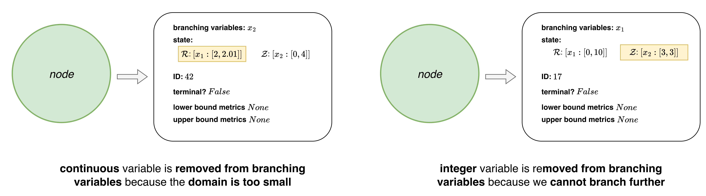

# Node 

A *node* represents all of the current bounds/branching information regarding the complicating variables. Each node object holds the following attributes:
- branching variables (i.e., complicating variables we are still allowed to branch on)
- current state (i.e., bounds on each of the complicating variables, organized by domain)
- ID (i.e., unique node identifier)
- lower bound solve metrics
- upper bound solve metrics
- if this node is terminal (i.e., if there are no more variables left to branch on)

Consider the illustrative example. The initialized root (i.e., first) node will contain the following information:

<p align="center">
  
</p>

After the node is processed and solved, the lower bound and upper bound solve metrics will be populated with information regarding the objective value and the solution. As new nodes are added to the tree, the bounds on the variables, ID, and branching variables will be updated as necessary when instantiating new nodes. 

---------------------------------

**Node FAQ's**

- Why aren't all variables branching variables?

Just because a variable has a state / is a complicating variable does not necessarily mean that we can branch on it when considering generation of new children. Consider the following two cases: 

<p align="center">
  
</p>

- Why is the state organized by variable domain?

We have the capability of relaxing integrality constraints at the lower bound- this means we cannot just identify variable domains based on the Pyomo setting of domain.

- What does it mean for a node to be terminal?

This just means that there are no other variables left to be branched on. Terminal is another way of indicating we have reached a leaf node, and should not try to spawn any children from this node.

- Why are the lower and upper bound metrics saved on the node?

This is because the node is passed around throughout the other objects. Also, not all of the information about the solves is destined to be saved; since a solved node is permanently deleted, we can store more information here, knowing it will be fully eliminated later.  

*see: snoglode/components/node.py*

## References
```{bibliography}
:filter: docname in docnames