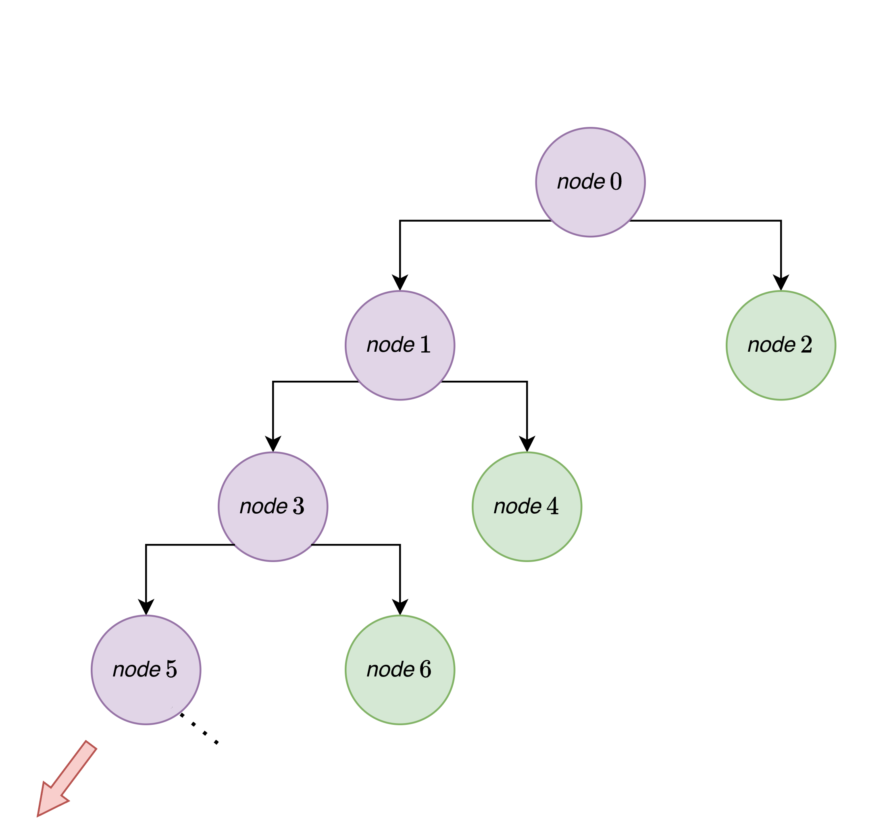
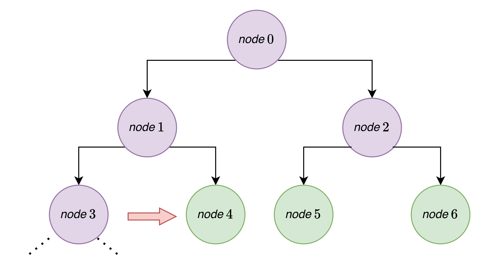
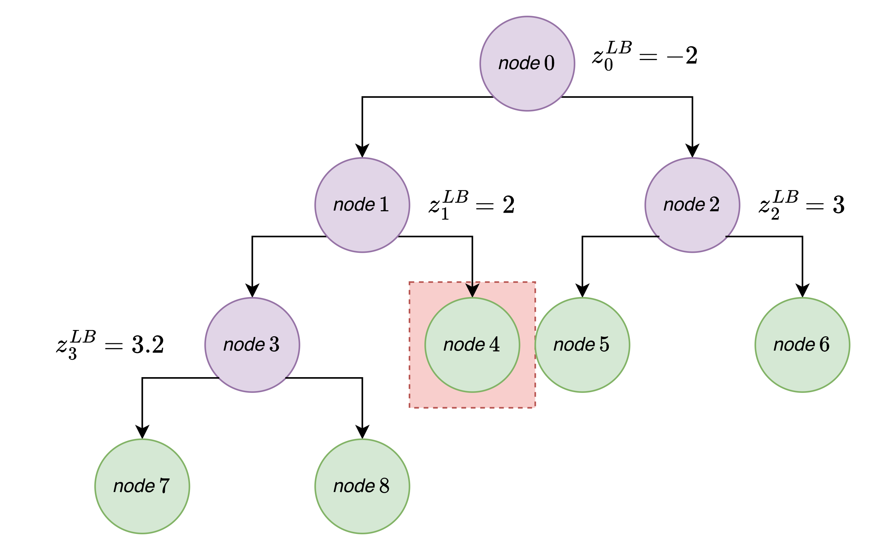

# Node Queue

As we maintain the tree, spawning nodes as problems are solved, the tree will more than likely have more than one *open* (i.e., unsolved) node. We store these nodes in a generic queue. Queuing strategies help us to determine which node to solve next, and can have a significant impact on runtime / convergence. Since we can only solve one node at a time, but will always spawn two (when we cannot prune by infeasibility/bound, anyways), strategically managing how we queue (or, in other words, traverse the tree) will be very important but also problem specific.

See: {cite}`morrison2016branch` for more in-depth discussions.

---------------------------

## LIFO: Last-In, First-Out

Also known as depth first search. 

<p align="center">
  
</p>

## FIFO: First-In, First-Out

Also known as breadth first search.

<p align="center">
  
</p>

## Worst Bound

This is the most commonly accepted branching methodology. The idea is as follows: to update the lower bound on the whole tree (and essentially progress the algorithm towards reaching the necessary termination condition), we have to solve the open nodes that are associated with the parent having the lowest lower bound. At the end of each iteration of the algorithm, we assign the 2 child nodes spawned from a parent a score that is equal to the parent nodes lower bound objective value. We then pop the node from the queue that has the lowest score. 


Consider the following worst-bound tree:

<p align="center">
  
</p>

The algorithm would have progressed as follows:
- solve root node, obtain a lower bound of $-2$.
- solve node $2$, obtain a lower bound of $3$

**Why not node $1$?**  $\rightarrow$ node $1$ and $2$ were considered equals so we just selected $2$ randomly.

- solve node $1$, obtain a lower bound of 2.

**Why not node $5$ or $6$?** $\rightarrow$ because node $1$ is associated with $-2$ while node $2$ is associated with $3$- worst bound queue tells us to selecting node 1!

- solve node $3$, obtain a lower bound of $3.2$.

**Why not node $5$ or $6$?** $\rightarrow$ same logic! 

**Why not node $4$?**  $\rightarrow$ node $3$ and $4$ were considered equals so we just selected $3$ randomly.

At this point, we want to make the choice between selection from nodes $[7,8,4,5,6]$. We will select node $4$ because it associated with the *worst* (i.e., *lowest*) lower bound thus far (for a value of $2$). Nodes $7$ and $8$ are associated with $3.2$ while nodes $5$ and $6$ are associated with $3$. And so we progress!

*see: snoglode/components/queues.py*

## References
```{bibliography}
:filter: docname in docnames