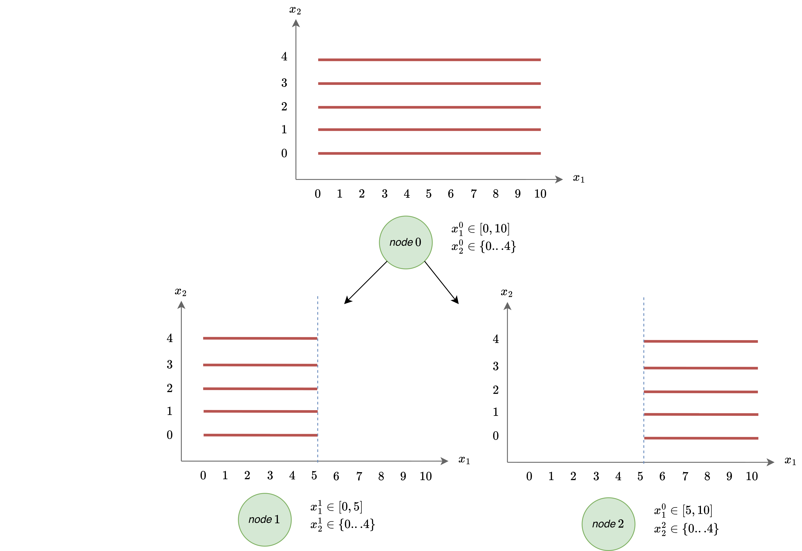

# Tree

The *tree* manages the nodes, dictates termination, and stores important solution information as the algorithm progresses. While there can (and in all probability will) be more than one node, there will be exactly one tree. 

The tree maintains the lineage of the nodes that have been generated so far. It tracks the increasingly reduced feasible space that we plan to explore. We can see this in a simple example below, where we elect to split at the midpoint of $x_1$ after solving the root node: 

  

For the most part, the tree will be used on the backend and will not need to be touched by users.

*see: snoglode/components/tree.py*

