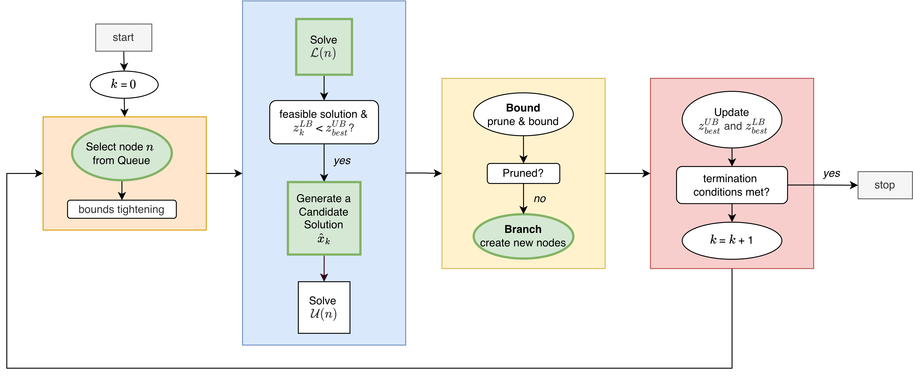

.. SNoGloDe documentation master file, created by
   sphinx-quickstart on Mon Nov 10 10:54:31 2025.
   You can adapt this file completely to your liking, but it should at least
   contain the root `toctree` directive.

SNoGloDe documentation
======================

This package provides a framework for solving block-angular decomposable (typically identifiable by complicating variables across subproblems) optimization problems using a *prioritized* spatial branch and bound tree.

There are four major algorithmic elements that form this framework:

- **Node selection**: which open node should be solved next / bounds tightening
- **Node processing**: generate a relaxation & determine a lower bound / generate a candidate & determine an upper bound
- **Branching & Bounding**: prune by bound or infeasibility / spawn new children
- **Termination evaluation**: check maximum time / epsilon gap / maximum iterations

These can be summarized (generally) in the following diagram:

The elements outlined in green have been implemented in a customizable callback manner. Users can update the logic of:

1. Node selection (e.g., queuing)  
2. Lower bound solution process (e.g., relaxations, warm-starting)  
3. Candidate generation  
4. Branching (e.g., child generation)  

by selecting in one of the available choices *or* by injecting their own logic.

If both the lower-bound relaxation *and* the upper-bound with a fixed candidate solution are solved to global optimality, there are provable convergence guarantees to the globally optimal solution. Otherwise, we can still search for feasible solutions and compute gaps, but there is no guarantee that the gap will close (though, it still might).

.. toctree::
   :maxdepth: 2
   :caption: Contents:

   installation
   quickstart
   tutorial
   components/index
   api/modules