# Tutorial

In this tutorial, we will demonstrate how to take a problem statement, formulate the problem such that it is compatible with `SNoGloDe`, and solve the problem with different `SNoGloDe` options.

## The Farmer Problem

A farmer must decide how much of each crop to plant (corn, wheat, and beets) before knowing the actual yields. She knows the cost of each planting an acre of each crop $230$ \$/acre, $150$ \$/acre, $260$ \$/acre, respectively and the amount of land she can plant on, $500$ acres. To satisfy livestock feed needs, at least $200$ T of wheat and $240$ T of corn are required—either produced on the farm or purchased from a wholesaler. Any surplus can be sold at market prices: \$ $170$/T for wheat and \$ $150$/T for corn. Sugar beets can be sold at \$ $36$/T up to a $6000$ T quota, and any excess only at \$ $10$/T. 

**The challenge lies in the uncertainty in the weather.**

The Farmer knows the yields for each of the crops ($2.5$ T/acre of wheat, $3$ T/acre of corn, $20$ T/acre of beets). Depending on the three possible weather outcomes, her yield is affected as follows: good $\rightarrow \times 1.2$ yield, average $\rightarrow \times 1$ yield, and bad $\rightarrow \times 0.8$ yield. After harvesting, the Farmer can make decisions about selling crops at market prices or purchasing additional crops to meet obligations. The goal is to choose a planting strategy that maximizes **expected profit** while accounting for variability in yields.

See {cite}`birge1997introduction` for a more involved description and analysis.

## Stochastic Programming Model

In this approach, we generate one model per scenario (i.e., 1 for good weather, 1 for average weather, and one for bad weather).
We will enforce complicating constraints that says we have to make the **same** planting decisions for each scenario model (i.e., the decision variable for how many beets to plant is constrained to be the same across all three models, etc.).
We will minimize the *expected* profit across all models. 
Depending on the actual outcome, we can adjust our remaining decisions (selling/buying) to maintain optimality. We recieve an optimal solution of:

<p align="center">
  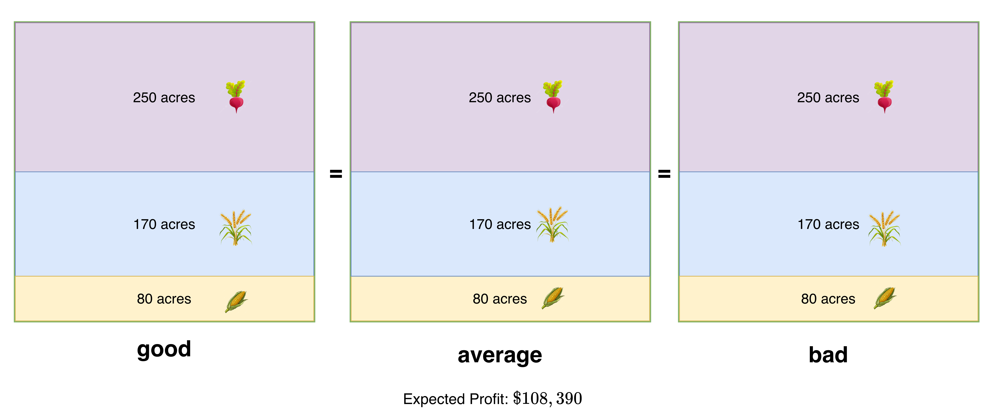
</p>

Here, we can see that the planting decisions **are the same** across all three possible scenarios (and, noticeably, is different from any of the three individual solutions above)!

Depending on which weather is ultimately realized, the Farmer would recieve the following yields:

<p align="center">
  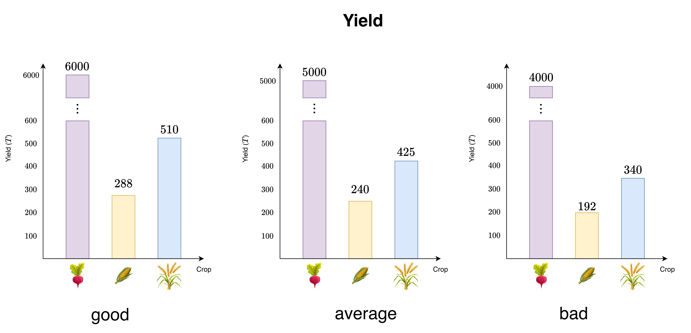
</p>

The Farmer can adjust the selling and buying decisions, once the uncertainty in her model is realized:

<p align="center">
  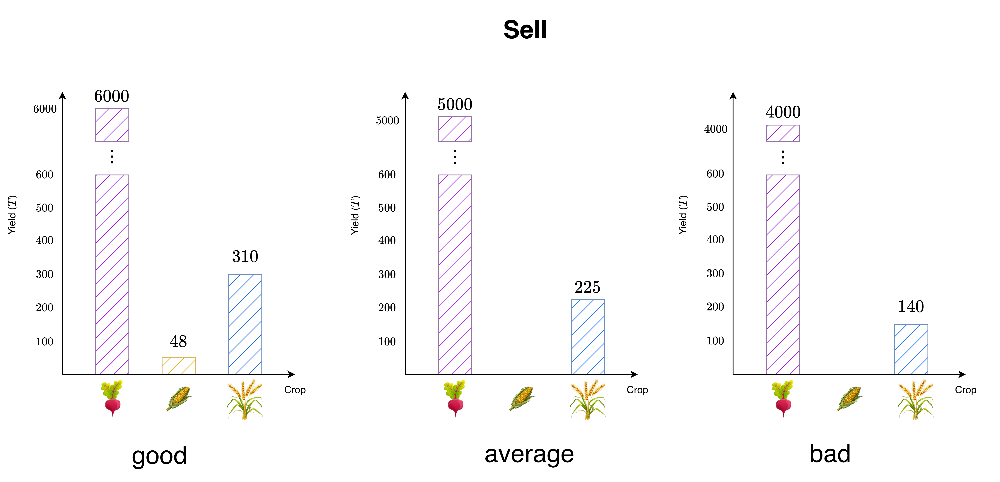
  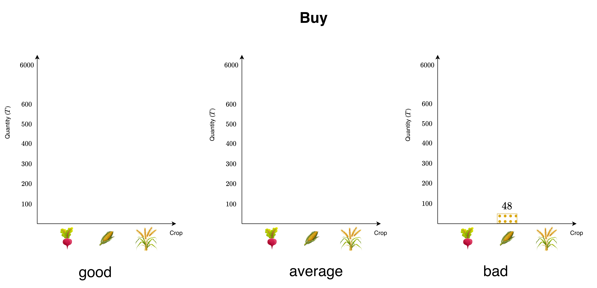
</p>

The question becomes: now that we know how we want to *model* the problem, how do we *solve it*? `SNoGloDe`, of course!

## Setup Farmer in `SNoGloDe`

In this case, we know that the planting decisions are **complicating** variables; they appear in all subproblems. The remaining decisions, what to buy and sell, are **non-complicating** variables (only appearing in their associated subproblem). 

We can picture the structure of this formulation as follows:

<p align="center">
  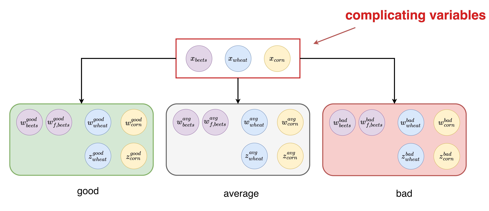
</p>

- planting decisions ($x_{beets}$, $x_{wheat}$, $x_{corn}$) $\rightarrow$ the same for all scenarios
- selling decisions ($w_{beets}^{s}$,$w_{f,beets}^{s}$, $w_{wheat}^{s}$, $w_{corn}^{s}$) $\rightarrow$ different per scenario $s{\in}[good,avg,bad]$.
- buying decisions ($z_{corn}^{s}$, $z_{wheat}^{s}$) $\rightarrow$  different per scenario $s{\in}[good,avg,bad]$.

**`SNoGloDe` can work with this- but first, we need to convert complicating variables into complicating constraints.**

We will define models that, instead of *sharing* complicating variables, will have their *own* complicating variables. We will then impose equality constraints saying each of the *subproblem-specific* complicating variables must be equal to one another.

In this case, this would look like:
- $x^{good}_{beets} = x^{avg}_{beets} = x^{bad}_{beets}$
- $x^{good}_{wheat} = x^{avg}_{wheat} = x^{bad}_{wheat}$
- $x^{good}_{corn} = x^{avg}_{corn} = x^{bad}_{corn}$

And we can picture the adjusted structure as follows:

<p align="center">
  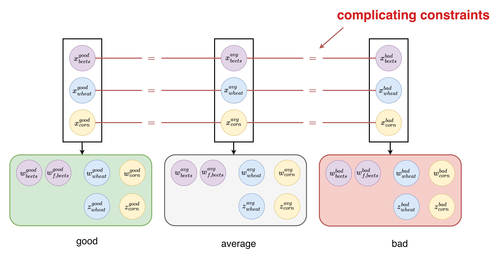
</p>

If we were to **remove** the complicating constraints, we recover the individual models! But, adding the constraints ensures we are solving the stochastic program. This provides us with a roadmap for building models within `SNoGloDe`.
We will build each of the models (with their subproblem specific copies of the complicating variables) and define the relationship between them (the complicating constraints).

First, let's write a function that creates a Pyomo model given a specific weather realization (recall: this just implies changing the yield by a constant multiplier).

```python
import pyomo.environ as pyo
class Farmer():

    def __init__(self, 
                 predicted_yield: float,
                 integer_first_stage: bool = False):
        """
        Parameters
        -----------
        predicted_yield : float
            realization of the expected yeild of this scenario
        integer_first_stage : bool
            if we should be using integers for the first stage planting decisions
        """
        assert type(predicted_yield)==float
        assert predicted_yield >= 0

        # predicted_yield = updated based on which weather pattern
        self.crop_yield={"wheat":2.5*predicted_yield, "corn":3*predicted_yield, "beets":20*predicted_yield}

        self.total_acres=500
        self.planting_cost={"wheat":150, "corn":230, "beets":260}
        self.planting_crops=["wheat","corn","beets"]
        self.selling_price={"wheat":170, "corn":150, "beets_favorable":36,  "beets_unfavorable":10}
        self.selling_crops=["wheat", "corn", "beets_favorable", "beets_unfavorable"]
        self.min_requirement={"wheat":200, "corn":240}
        self.purchase_price={"wheat":238, "corn":210}
        self.purchasing_crops=["wheat","corn"]
        self.required_crops=self.purchasing_crops
        self.beets_quota=6000

        self.integer_first_stage = integer_first_stage
        model = pyo.ConcreteModel()

        """ VARIABLES """

        # land variables [=] acres of land devoted to each crop
        if self.integer_first_stage: domain = pyo.NonNegativeIntegers
        else: domain = pyo.Reals
        model.x=pyo.Var(self.planting_crops, 
                        within=domain,
                        bounds=(0,500))

        # selling decision variables [=] tons of crop sold
        model.w=pyo.Var(self.selling_crops, 
                        within=pyo.Reals,
                        bounds=(0,10000))

        # purchasing decision variables [=] tons of crop purchased
        model.y=pyo.Var(self.purchasing_crops, 
                        within=pyo.Reals,
                        bounds=(0,10000))

        """ CONSTRAINTS """

        model.planting_cost=sum(model.x[planted_crop]*self.planting_cost[planted_crop] for planted_crop in self.planting_crops)
        model.selling_cost=sum(model.w[sold_crop]*self.selling_price[sold_crop] for sold_crop in self.selling_crops)
        model.puchasing_cost=sum(model.y[purchased_crop]*self.purchase_price[purchased_crop] for purchased_crop in self.purchasing_crops)
        model.obj=pyo.Objective( expr= model.planting_cost - model.selling_cost + model.puchasing_cost )

        # total acres allocated cannot exceed total available acreas
        @model.Constraint()
        def total_acreage_allowed(model):
            return ( sum(model.x[planted_crop] for planted_crop in self.planting_crops) <= self.total_acres )

        # must have at least x of wheat,corn
        @model.Constraint(self.required_crops)
        def minimum_requirement(model, required_crop):
            return ( model.x[required_crop]*self.crop_yield[required_crop] + model.y[required_crop] - model.w[required_crop] \
                       >= self.min_requirement[required_crop])
        
        @model.Constraint()
        def sugar_beet_mass_balance(model):
            return ( model.w["beets_favorable"] + model.w["beets_unfavorable"] \
                    <= self.crop_yield["beets"]*model.x["beets"] )

        # the favorably priced beets cannot exceed 6000 (T)
        @model.Constraint()
        def sugar_beet_quota(model):
            return ( model.w["beets_favorable"] <= self.beets_quota )
        
        self.model = model
```

From here, we can define a subproblem creator. This function is a helper function for building the entire stochastic program (with complicating constraints). 
It will be invoked once per each subproblem - where we will pass it each element in the list of subproblem_names = ["good", "avg", "bad"].

This callback needs to provide the following information for each subproblem:

1. **Pyomo model** associated with that particular scenario ($s{\in}[good,avg,bad]$)
2. **Complicating constraints mapping** (a dictionary, where each key dictates *which* complicating variable we are using, and each value is the associated Pyomo variable within that model.)
3. **Probability/Weight** of this particular subproblem. 

The complicating constraints map is defined used a Python dictionary, with the goal of capturing the relationship defined by the complicating constraints. We need to determine *which* variables, across subproblems, need to be equated to one another. In this case, it will be each of the planting decisions based on crop:

<p align="center">
  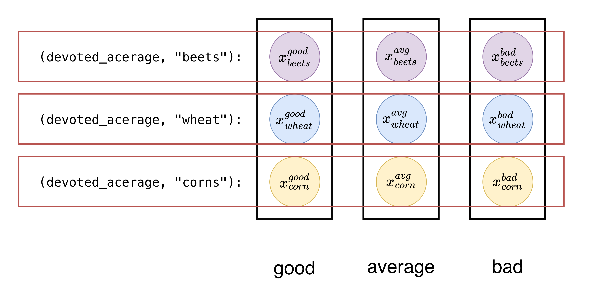
</p>

Each dictionary associated with each scenario has the *same keys*, but provide *different Pyomo variables*. `SNoGloDe` will take this information, and enforce complicating equality constraints across all variables provided that share keys across the subproblems.

```python
subproblem_names = ["good", "avg", "bad"]
def subproblem_creator(scenario_name):
    """
    Based on the scenario, generates 
        1) the pyomo model
        2) the dict of complicating variable IDS : pyo.Var
        3) probability of subproblem
    and returns as a list in this order.
    """
    name_to_yield_map = {
        "good": 1.2,
        "avg": 1.0,
        "bad": 0.8
    }
    
    # create parameters / model stored in obj for this scenario
    farmer_scenario = Farmer(name_to_yield_map[scenario_name])

    # grab the list of first stage variables
    complicating_variable_ids = {("devoted_acrege", crop): farmer_scenario.model.x[crop] \
                                for crop in farmer_scenario.planting_crops}
    
    # probability of this particular scenario occuring
    scenario_probability = 1/3

    return [farmer_scenario.model,              # pyomo model corresponding to this subproblem
            complicating_variable_ids,          # complicating varID : pyo.Var dict
            scenario_probability]               # probability of this subproblem
```

The only thing left is to define `SNoGloDe` itself. `SNoGloDe` has many customizable elements- we define a SolverParameters object that takes in all the necessary elements (solvers, subproblem creator, subproblem names) and allows us to manage the customizable elements. For now, we will leave most of the defaults in place.

```python
import snoglode as sno

# define the necessary elements -> names, creator, and all the solvers
params = sno.SolverParameters(subproblem_names = subproblem_names,
                              subproblem_creator = subproblem_creator,
                              lb_solver = pyo.SolverFactory("gurobi"),
                              cg_solver = pyo.SolverFactory("gurobi"),
                              ub_solver = pyo.SolverFactory("gurobi"))

# turn off FBBT / OBBT
params.set_bounds_tightening(fbbt=False, obbt=False) 

# create actual solver object
solver = sno.Solver(params)
```

We have initialized all the necessary information - now we can try to solve the problem.

## Node Queueing (`NodeQueue`)

As we maintain the tree, spawning nodes as problems are solved, the tree will more than likely have more than one *open* (i.e., unsolved) node. We store these nodes in a generic queue. Queuing strategies help us to determine which node to solve next, and can have a significant impact on runtime / convergence. Since we can only solve one node at a time, but will always spawn two (when we cannot prune by infeasibility/bound, anyways), strategically managing how we queue (or, in other words, traverse the tree) will be very important but also problem specific.

Options available in `SNoGloDe`:
- LIFO
- FIFO
- Worst-bound

Consider the following defaults for `SNoGloDe`'s other elements:

```python
params.set_bounders(candidate_solution_finder = sno.SolveExtensiveForm,
                    lower_bounder = sno.DropNonants)
params.set_branching(selection_strategy = sno.RandomSelection,
                     partition_strategy = sno.Midpoint)
```

We will give each of the queuing strategies 100 iterations to make the most progress on the problem, before we evaluate their performance.
```python
params.set_queue_strategy(strategy = sno.QueueStrategy.lifo)
lifo_solver = sno.Solver(params)
result = lifo_solver.solve(max_iter = 100)
```

```python
params.set_queue_strategy(strategy = sno.QueueStrategy.fifo)
fifo_solver = sno.Solver(params)
result = fifo_solver.solve(max_iter = 100)
```

```python
params.set_queue_strategy(strategy = sno.QueueStrategy.bound)
bound_solver = sno.Solver(params)
result = bound_solver.solve(max_iter = 100)
```

Because we used `SolveExtensiveForm` for the incumbent finder, we can see the local solution to the full problem is, in fact, the global solution (this makes sense, considering we are solving a linear program). 

<p align="center">
  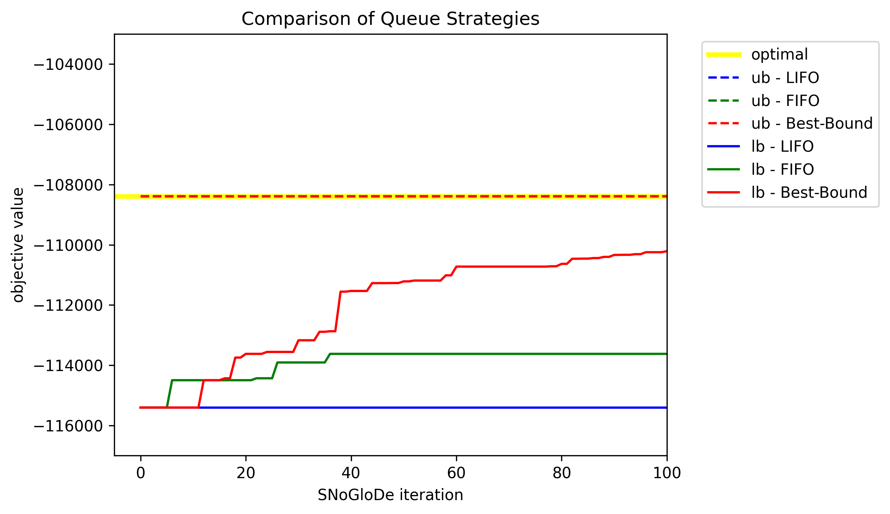
</p>

What we can see, however, is a clear difference in `SNoGloDe`'s performance depending on which queue strategy is used. As expected, best bound (in red) performs the best; LIFO (in blue) doesn't produce much progress and FIFO (in green) has modest returns but nothing compared to best-bound. Once our problem had been intialized, testing each of these three different algorithms took only 9 lines of code!

## Primal/Candidate Solutions (`CandidateGenerator`)

Candidate solutions are the building blocks for the upper bound (i.e. primal) solution. We must search for feasible solutions to the optimization problem. In this case, we will accomplish this by proposing candidate solutions for the complicating variables ($\hat{x}_{beets}$, $\hat{x}_{corn}$, $\hat{x}_{wheat}$), fixing them within the optimization problems, and optimizing for the values of the non-complicating variables (selling/decisions $y$/$z$). The beauty of this is that it allows us to solve each subproblem independently! 

**The question we have to ask is: *how* do we come up with good candidate solutions?**

In `SNoGloDe`, we have two preset options:
- **`SolveExtensiveForm`**: The extensive form refers to the overall problem formulation where we have the complicating constraints imposed on the problem. In a nonlinear program, which may have many local optimum, this approach can be quite useful. 
- **`AverageLowerBoundSolution`**: At each lower bound solution, because we drop the complicating constraints, we will have a different solution for each of the complicating variables in each subproblem... so why don't we use it to our advantage? Average the solutions for all of the subproblem-specific copies of the complicating variables and test that as the primal solution.


```python
params.set_bounders(lower_bounder = sno.DropNonants)
params.set_branching(selection_strategy = sno.RandomSelection,
                     partition_strategy = sno.Midpoint)
params.set_queue_strategy(strategy = sno.QueueStrategy.bound)
```

We will give each of the queuing strategies 100 iterations to make the most progress on the problem, before we evaluate their performance.

```python
params.set_bounders(candidate_solution_finder = sno.SolveExtensiveForm)
ef_solver = sno.Solver(params)
result = ef_solver.solve(max_iter = 100)
```

```python
params.set_bounders(candidate_solution_finder = sno.AverageLowerBoundSolution)
avglb_solver = sno.Solver(params)
result = avglb_solver.solve(max_iter = 100)
```

<p align="center">
  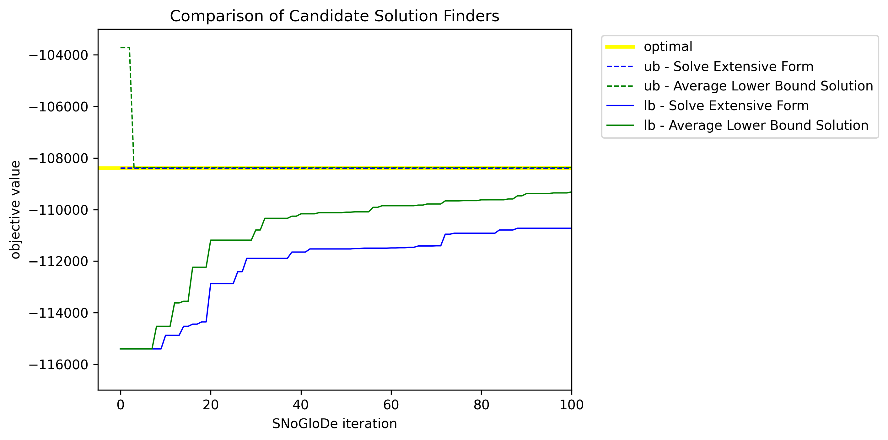
</p>

The value of the upper bound affects our tree search by determining which subdomains can be prund.
Despite the fact that `SolveExtensiveForm` finds the optimal primal solution at the first iteration, `AverageLowerBound` eventually outperforms it. 
This can be attributed to the fact that we are performing *different* tree searches; `AverageLowerBound` got a bit lucky here. 

## Branching: `SelectionStrategy` 

Branching is an essential (noteably heuristic) element inherent to any branch and bound procedure. Branching is when a node, after being solved, cannot be pruned by bound (i.e., when the lower bound is higher than the current best upper bound) or by infeasibility (i.e., when the lower bound relaxation is infeasible), and is not terminal. 

To spawn a child node, we must select exactly one of the branching variables (referred to as **variable selection**). Then, we must determine where to split that variable domain (referred to as **split point selection**). 

Selection strategies refer to *how* we select the next variable to branch on, while partition strategies refer to how we *split* the selected variables domain.

In `SNoGloDe`, we offer the following for `SelectionStrategy` presets:
- **`RandomSelection`**
- **`MostInfeasibleBinary`**
- **`MaximumDisagreement`**
- **`Pseudocost`**
- **`StrongBranching`** / **`FullStrongBranching`**
- **`HybridBranching`**

We will not test `MostInfeasibleBinary`, as we do not have any binary variables in this model.
`StrongBranching` and `FullStrongBranching` are the same, except `FullStrongBranching` explores *every single* complicating variable, while `StrongBranching` selects a random subset. 

```python
params.set_bounders(lower_bounder = sno.DropNonants,
                    candidate_solution_finder = sno.AverageLowerBoundSolution)
params.set_queue_strategy(strategy = sno.QueueStrategy.bound)
params.set_branching(partition_strategy = sno.Midpoint)
```

We will give each of the branching selection strategies 100 iterations to make the most progress on the problem, before we evaluate their performance.

```python
params.set_branching(selection_strategy = sno.RandomSelection)
random_solver = sno.Solver(params)
result = random_solver.solve(max_iter = 100)
```

```python
params.set_branching(selection_strategy = sno.MaximumDisagreement)
maxdis_solver = sno.Solver(params)
result = maxdis_solver.solve(max_iter = 100)
```

```python
params.set_branching(selection_strategy = sno.Pseudocost)
pseudocost_solver = sno.Solver(params)
result = pseudocost_solver.solve(max_iter = 100)
```

```python
params.set_branching(selection_strategy = sno.FullStrongBranching)
fstrong_solver = sno.Solver(params)
result = fstrong_solver.solve(max_iter = 100)
```

<p align="center">
  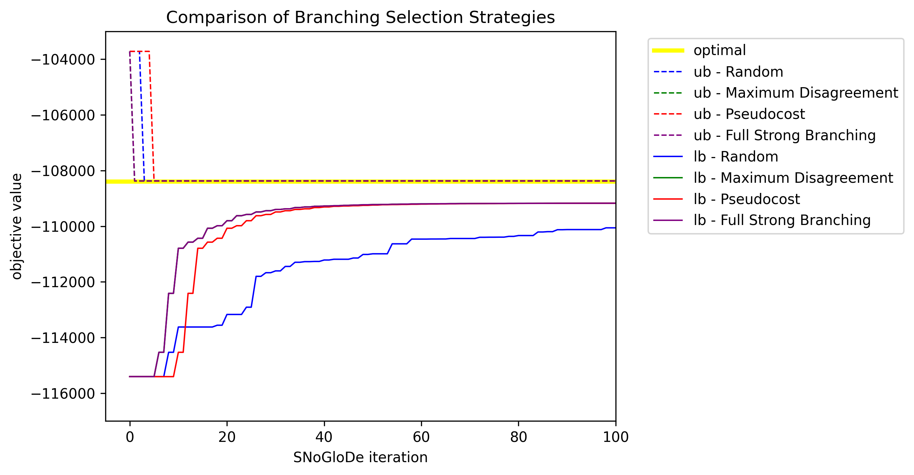
</p>

In this case, we can see `FullStrongBranching` and `MaximumDisagreement` performed the best (their values are essentially overlaid on one another). `Pseudocost` caught up by the end, which makes sense because, as it had time to learn better costing information, it could make actual informed decisions. Random, as expected, doesn't perform particularly well. 

## Branching: `PartitionStrategy`

In `SNoGloDe`, we offer the following for `PartitionStrategy` presets:
- **`Midpoint`**
- **`ExpectedValue`**

This is inherently coupled to `SelectionStrategy`; once we choose which variable to branch, we have to decide *how* to split the variable domain. The midpoint takes the current variable bounds, and splits it down the middle while expected value takes the average of all current lower bound solutions for the complicating variables 


```python
params.set_bounders(lower_bounder = sno.DropNonants,
                    candidate_solution_finder = sno.AverageLowerBoundSolution)
params.set_queue_strategy(strategy = sno.QueueStrategy.bound)
params.set_branching(selection_strategy = sno.FullStrongBranching)
```

We will give each of the branching partition strategies 100 iterations to make the most progress on the problem, before we evaluate their performance.

```python
params.set_branching(partition_strategy = sno.Midpoint)
midpoint_solver = sno.Solver(params)
result = midpoint_solver.solve(max_iter = 100)
```

```python
params.set_branching(partition_strategy = sno.ExpectedValue)
ev_solver = sno.Solver(params)
result = ev_solver.solve(max_iter = 100)
```

<p align="center">
  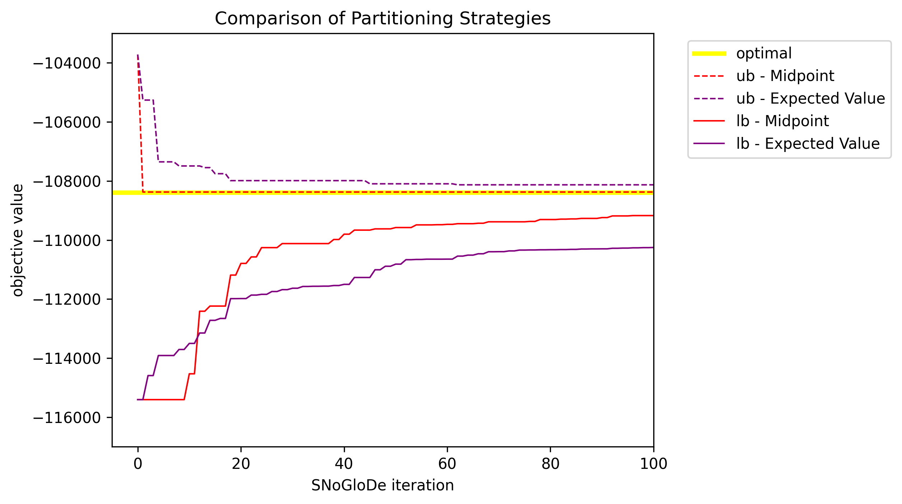
</p>

## Lower Bounding (`LowerBounder`)

We only offer one lower bounding option - `DropNonants`, which just drops the complicating constraints and solves each of the subproblems separately. We could try and further relax the problem - let's consider an alteration to the problem. 


### Integer Farmer

For this example, we have an entirely continuous problem (i.e., $x$, $y$, and $z$ are positive reals). Let's now assume we have to make planting decisions that are now *integer*; we cannot plant 1.5 acres of wheat, it's either 1 acre or 2 acres. This can allow us to write a custom lower bounder, that further relaxes the problem by disregarding integrality.

It also helps that the optimal solution to the LP has an integral solution, so we maintain the same optimal solution!

```python
def integer_subproblem_creator(scenario_name):
    """
    Based on the scenario, generates 
        1) the pyomo model
        2) the dict of complicating variable IDS : pyo.Var
        3) the list of subprob lem specific variables (pyo.Vars)
        3) probability of subproblem
    and returns as a list in this order.
    """
    name_to_yield_map = {
        "good": 1.2,
        "fair": 1.0,
        "bad": 0.8
    }
    
    # create parameters / model stored in obj for this scenario
    farmer_scenario = TwoStageFarmer(name_to_yield_map[scenario_name],
                                     integer_first_stage = True) # <- NOTE: HERE IS THE MAJOR CHANGE

    # grab the list of first stage variables
    complicating_variable_ids = {("devoted_acrege", crop): farmer_scenario.model.x[crop] \
                                for crop in farmer_scenario.planting_crops}
    
    # probability of this particular scenario occuring
    scenario_probability = 1/3

    return [farmer_scenario.model,              # pyomo model corresponding to this subproblem
            complicating_variable_ids,          # complicating varID : pyo.Var dict
            scenario_probability]               # probability of this subproblem

subproblem_names = ["good", "fair", "bad"]
integer_params = sno.SolverParameters(subproblem_names = subproblem_names,
                                      subproblem_creator = integer_subproblem_creator,
                                      lb_solver = pyo.SolverFactory("gurobi"),
                                      cg_solver = pyo.SolverFactory("gurobi"),
                                      ub_solver = pyo.SolverFactory("gurobi"))
integer_params.set_bounds_tightening(False, False)
```

Note the only difference between `subproblem_creator()` and `integer_subproblem_creator()` is when we create the farmer scenario model; `TwoStageFarmer` has an optional argument to enforce the complicating variables $x$ to be integer.

### Custom Lower Bounder

Next, we can implement the `CustomLowerBounder` inherited class. This class is a derived class from the `AbstractLowerBounder`. It has an `__init__()` for any extra elements we want to save per iteration, and a callback `solve_a_subproblem()` that will be invoked for *each subproblem* at *each iteration*.

In this case, if we were on the $k^{\text{th}}$ iteration, then we would call `solve_a_subproblem()` 3 times (`subproblem_name = good`, `subproblem_name = avg`, `subproblem_name = bad`). Each callback should solve the model passed, and return if the solution was feasible and what the objective value is. 

```python
from pyomo.opt import TerminationCondition, SolverStatus

class CustomLowerBounder(sno.AbstractLowerBounder):
    def __init__(self,  solver: str) -> None:
        super().__init__(solver = solver)

    def solve_a_subproblem(self, subproblem_name: str, subproblem_model: pyo.ConcreteModel, subproblem_complicating_vars: dict):
        """
        Parameters
        -----------
        subproblem_name : str
            String corresponding to this subproblems name
        subproblem_model : pyo.ConcreteModel
            pyomo model corresponding to this subproblem
        subproblem_complicating_vars : dict
            dictionary corresponding to this current subproblems complicating variables

        Returns
        -----------
        feasible : bool
            if the solve of the subproblem model was feasible or not
        objective : float
            objective value of the subproblem model; None if infeasible.
        """

        # RELAX INTEGERS
        subproblem_model.x["beets"].domain = pyo.NonNegativeReals
        subproblem_model.x["corn"].domain = pyo.NonNegativeReals
        subproblem_model.x["wheat"].domain = pyo.NonNegativeReals

        # solve model
        results = self.opt.solve(subproblem_model, load_solutions = False, symbolic_solver_labels=True, tee = False)
        
        # UN-RELAX INTEGERS
        subproblem_model.x["beets"].domain = pyo.Integers
        subproblem_model.x["corn"].domain = pyo.Integers
        subproblem_model.x["wheat"].domain = pyo.Integers

        # if the solution is optimal, return objective value
        if results.solver.termination_condition==TerminationCondition.optimal and results.solver.status==SolverStatus.ok:

            # load in solutions, return [feasibility = True, obj, results]
            subproblem_model.solutions.load_from(results)

            # return the value of the singular active objective.
            return True, pyo.value(subproblem_model.obj)
        
        # if the solution is not feasible, return None
        elif results.solver.termination_condition == TerminationCondition.infeasible:
            return False, None

        else:
            raise RuntimeError(f"unexpected termination_condition for lower bounding problem: {results.solver.termination_condition}")
```

We follow the following logic:
- Relax the integer complicating variables $x$ domains from integers $\rightarrow$ reals.
- Solve the subproblem model.
- Update the integer complicating variables $x$ domains from reals $\rightarrow$ back to integers.
- If the solution was feasible/optimal $\rightarrow$ return `True` and the objective value.
- If the solution was infeasible $\rightarrow$ return `False` and `None`.
- If the solution terminated in an unexpected way, raise an error.

All we have to do now is pass this into the parameters for the solver. In this case, it will be passed as the argument for the `params.set_bounds(lower_bounder = CustomLowerBounder)`. While we're at it, we can add the other options we want (based on what worked best before, I suppose).

### `CustomLowerBounder(AbstractLowerBounder)`

```python
integer_params.set_bounders(lower_bounder = CustomLowerBounder,
                            candidate_solution_finder = sno.AverageLowerBoundSolution)
integer_params.set_queue_strategy(strategy = sno.QueueStrategy.bound)
integer_params.set_branching(selection_strategy = sno.FullStrongBranching,
                             partition_strategy = sno.Midpoint)
custom_solver = sno.Solver(integer_params)
result = custom_solver.solve(max_iter = 100)
```

### `DropNonants` (Default)

```python
integer_params.set_bounders(lower_bounder = sno.DropNonants)
dropnonants_solver = sno.Solver(integer_params)
result = dropnonants_solver.solve(max_iter = 100)
```

<p align="center">
  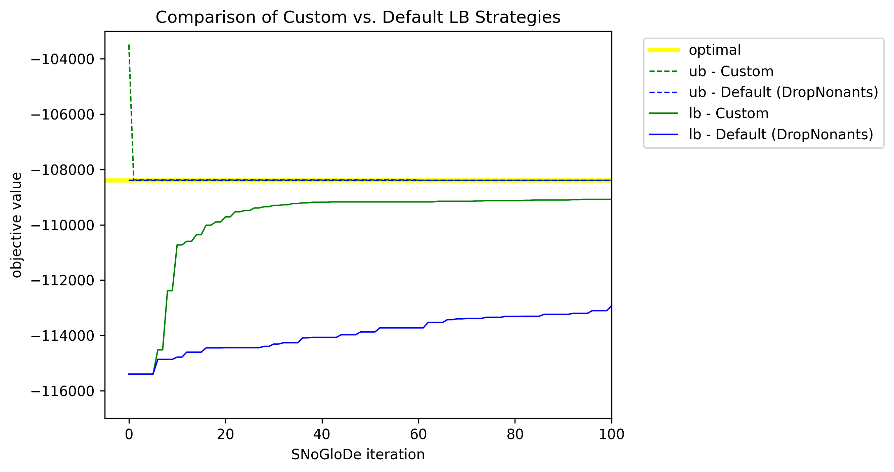
</p>

Clearly, imposing problem specific information (even as simple as knowledge of integrality constraints) can make a *huge* difference in the progression of the algorithm. Customization can be significantly involved, or as simple as changing variable domains.

A word of caution: `SNoGloDe` can do a lot, but it cannot check if your lower bounding / relaxation logic is correct. If you're considering customization, double/triple check your logic. 
## References
```{bibliography}
:filter: docname in docnames